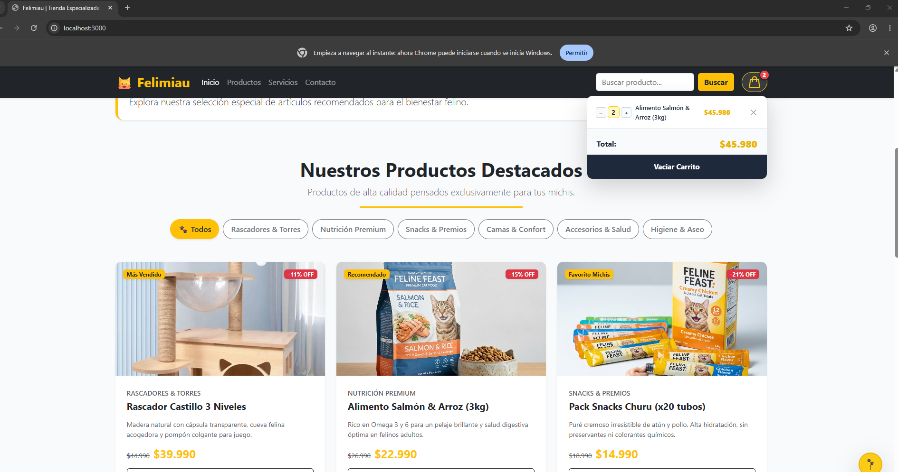
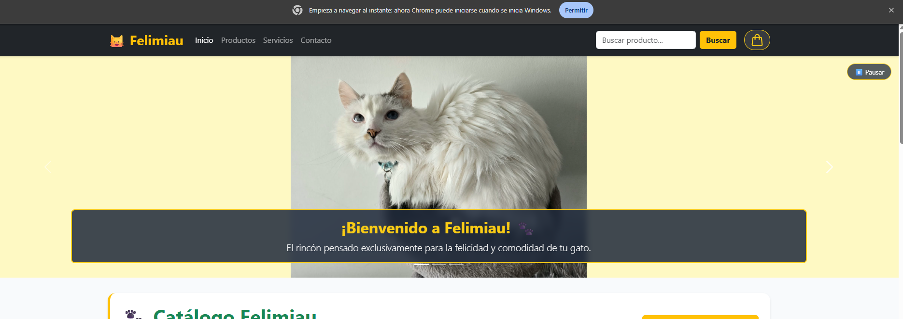

# 🐱 Felimiau — eCommerce Interactivo en React

Proyecto desarrollado para la asignatura **Desarrollo Frontend I (PFY2201)** — **Experiencia 3 / Semana 7**.

---

## 👩‍💻 Información del Proyecto
* **Estudiante:** Carolina Delgado
* **Asignatura:** Desarrollo Frontend I (PFY2201)
* **Institución:** Duoc UC
* **Tecnologías:** React 19, Vite, Bootstrap 5.3, JavaScript (ES6+), CSS Modular
* **Repositorio GitHub:** [https://github.com/Lybern/Carolina_Delgado_PFY2201_S7](https://github.com/Lybern/Carolina_Delgado_PFY2201_S7)
* **Despliegue en línea (GitHub Pages):** [https://lybern.github.io/Carolina_Delgado_PFY2201_S7/](https://lybern.github.io/Carolina_Delgado_PFY2201_S7/)

---

## 📋 Descripción de la Actividad
En esta etapa se migró y enriqueció la tienda web **Felimiau** hacia el ecosistema **React con Vite**, estructurando componentes funcionales modulares, gestionando estados interactivos con Hooks (`useState`, `useEffect`) y añadiendo la experiencia completa de un **Carrito de Compras dinámico**, conservando la interfaz visual y la identidad de marca desarrollada en las entregas anteriores.

---

## 📸 Evidencias de la Aplicación en Funcionamiento

### 1. Catálogo de Productos y Carrito de Compras con Controles de Cantidad

*Visualización de los filtros interactivos por categoría (Nav-Pills), tarjetas con precios normales tachados, ofertas destacadas y ventana flotante del carrito con botones de incremento/decremento (`+`/`-`) y recálculo dinámico de subtotales en pesos chilenos.*

### 2. Carrusel Accesible con Fondo Ambiental Cinemático

*Carrusel con fotografías de los gatitos Blanquito y Talia, fondo ambiental con efecto desenfocado (`blur`), textos flotantes contrastados y botón WCAG de Pausa/Reanudación.*

---

## 🚀 Funcionalidades Implementadas

### 1. Catálogo de Productos Completo
Cada producto se presenta con la información requerida por la pauta:
* **Nombre del producto:** Identificación clara del artículo felino.
* **Precio normal:** Precio de lista tachado para evidenciar el descuento.
* **Precio de oferta:** Precio destacado con el valor final de venta en CLP ($).
* **Descripción resumida:** Detalles de materiales, beneficios y usos.
* **Imagen del producto:** Fotos de alta calidad de los michis y productos de cuidado con ajuste `object-fit: contain` para evitar recortes.
* **Filtros por categoría (Nav-Pills):** Botones redondeados de Bootstrap para filtrar en tiempo real entre *Todos*, *Rascadores*, *Nutrición*, *Snacks*, *Camas*, *Accesorios* e *Higiene*.
* **Ficha Técnica Modal:** Botón *Ver detalles* en cada tarjeta que despliega una ventana modal de Bootstrap con dimensiones, composición química y recomendaciones veterinarias.

### 2. Gestión Integral del Carrito de Compras
* **Agregar productos:** Añade artículos al carrito. Si el producto ya existe, incrementa su cantidad (`quantity`) sin generar filas duplicadas.
* **Modificar unidades (`+` y `-`):** Botones interactivos en cada fila del carrito para aumentar o disminuir cantidades con recálculo automático de subtotales.
* **Eliminar productos:** Botón con icono de cruz (`✕`) en cada fila para remover productos específicos recalculando el total y el contador.
* **Contador dinámico condicional:** Burbuja roja que aparece únicamente cuando hay productos en el carrito, ocultando el número cero por defecto.
* **Cálculo del total acumulado:** Suma matemática en pesos chilenos ($ CLP) de todos los productos y cantidades seleccionadas.
* **Vaciar carrito:** Botón de acción global para restablecer el carrito a cero.
* **Renderizado condicional:** Muestra el mensaje *"El carrito está vacío"* cuando no hay artículos agregados.

### 3. Interfaz Integral de Felimiau
* **Navbar Sticky:** Barra de navegación superior con logotipo, enlaces de sección, buscador y carrito desplegable.
* **Carrusel Accesible (WCAG):** Controlado nativamente con React (`useState` + `useEffect`), rotación automática y botón de Pausar / Reanudar.
* **Notificación Toast de Bootstrap:** Alerta flotante en la esquina inferior que confirma al usuario cada producto agregado al carrito.
* **Botón Scroll to Top 🐾 ⬆️:** Botón flotante que aparece al descender y permite regresar al inicio de la página con desplazamiento suave.
* **Banner de Ofertas Especiales:** Sección interactiva con botón para alternar dinámicamente promociones de la semana.
* **Servicios & Beneficios:** Columnas informativas de despacho, calidad aprobada y pago seguro.
* **Formulario de Contacto:** Formulario con validación de campos y mensaje de confirmación controlado con React.
* **Footer Semántico:** Información de derechos reservados y autoría del proyecto.

---

## 📂 Estructura Modular de Componentes
```text
src/
├── components/
│   ├── Carousel.jsx           # Carrusel accesible controlado con React
│   ├── ContactForm.jsx        # Formulario de contacto interactivo
│   ├── Footer.jsx             # Pie de página semántico
│   ├── Header.jsx             # Barra de navegación con carrito desplegable y botones +/-
│   ├── OffersBanner.jsx       # Banner de ofertas especiales semanales
│   ├── ProductDetailModal.jsx # Ventana modal con ficha técnica de cada producto
│   ├── ProductList.jsx        # Catálogo de tarjetas con filtros Nav-Pills
│   ├── ScrollToTop.jsx        # Botón flotante interactivo para volver arriba
│   ├── Services.jsx           # Beneficios y garantías de Felimiau
│   └── ToastNotification.jsx  # Notificación flotante de confirmación (Bootstrap Toast)
├── data.js                    # Dataset oficial con precios, ofertas, fotos y especificaciones
├── App.jsx                    # Componente raíz con el estado global del carrito
├── App.css                    # Estilos visuales personalizados y responsive design
├── index.css                  # Variables de color y tipografía base
└── main.jsx                   # Punto de entrada de la aplicación en React
```

---

## 🛠️ Ejecución Local del Proyecto

1. Clonar el repositorio:
   ```bash
   git clone https://github.com/Lybern/Carolina_Delgado_PFY2201_S7.git
   cd Carolina_Delgado_PFY2201_S7
   ```
2. Instalar dependencias:
   ```bash
   npm install
   ```
3. Iniciar el servidor de desarrollo:
   ```bash
   npm run dev
   ```
4. Abrir en el navegador:
   `http://localhost:3000`

---

## 📦 Despliegue en GitHub Pages

Para compilar y publicar en la rama `gh-pages`:
```bash
npm run deploy
```
La aplicación compila a la carpeta `dist` y se publica automáticamente en GitHub Pages.
